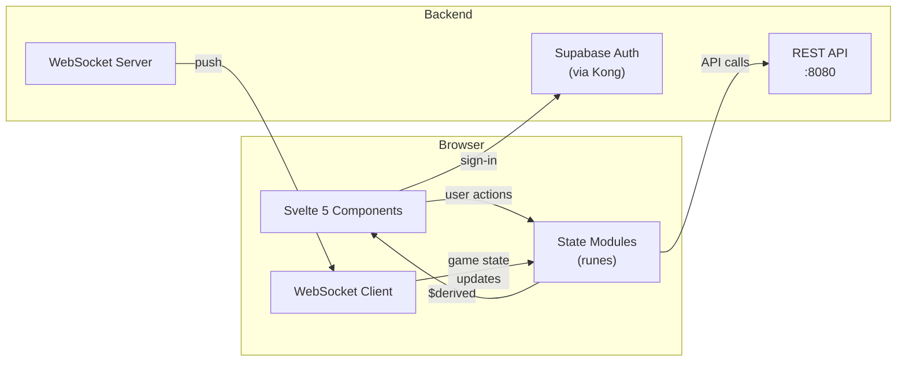
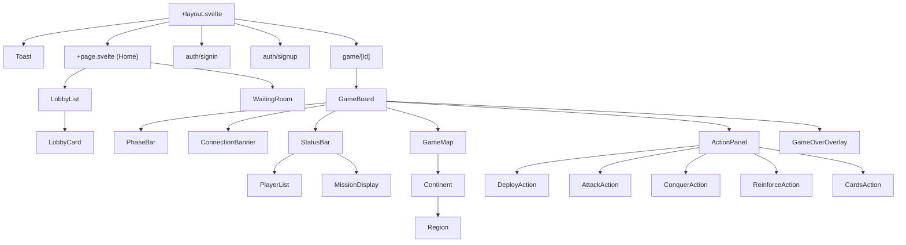

# GO Risk-It Frontend

[](https://github.com/go-risk-it/go-risk-it-frontend/actions/workflows/ci.yml)

The web frontend for [go-risk-it](https://github.com/go-risk-it/go-risk-it) — a multiplayer online Risk board game. Built with Svelte 5 and SvelteKit.

**[Backend Repository](https://github.com/go-risk-it/go-risk-it)** | **[Frontend Architecture](docs/architecture.md)** | **[Backend Architecture](https://github.com/go-risk-it/go-risk-it/blob/main/docs/architecture.md)** | **[Game Rules](https://github.com/go-risk-it/go-risk-it/blob/main/docs/game-rules.md)**

## Architecture at a Glance



See [Frontend Architecture](docs/architecture.md) for state management details, WebSocket reconnection strategy, component data flow, and more.

## Prerequisites

- [Node.js 18+](https://nodejs.org/)
- Running backend (`make run` in the [backend repo](https://github.com/go-risk-it/go-risk-it))

## Quick Start

```bash
npm install
npm run dev
```

The app is available at `http://localhost:5173`. The Vite dev server proxies API and WebSocket requests to the backend:

| Frontend Path | Backend Target |
|---------------|----------------|
| `/api/*` | `http://localhost:8080` |
| `/ws/*` | `ws://localhost:8080` |

## Running with Backend

The frontend needs the backend running to function. Full stack setup:

1. **Start backend** (in the [backend repo](https://github.com/go-risk-it/go-risk-it)):
   ```bash
   make run
   ```
   This starts the Go server, PostgreSQL, Supabase auth, and Jaeger via Docker Compose.

2. **Start frontend**:
   ```bash
   npm install
   npm run dev
   ```

3. **Play** — Open `http://localhost:5173`. Sign up two accounts in separate browser windows to start a game.

## Scripts

| Command | Description |
|---------|-------------|
| `npm run dev` | Start dev server |
| `npm run build` | Production build (static adapter) |
| `npm run preview` | Preview production build |
| `npm run check` | Type check with svelte-check |
| `npm run check:watch` | Type check in watch mode |
| `npm run test` | Run unit tests (Vitest) |
| `npm run test:watch` | Run unit tests in watch mode |
| `npm run test:e2e` | Run E2E tests (Playwright) |
| `npm run test:e2e:ui` | Run E2E tests with Playwright UI |

## Testing Strategy

- **Unit tests** (Vitest + @testing-library/svelte): Test state management, utilities, and components in isolation with jsdom. Covers card validation logic, graph algorithms, color mapping, WebSocket reconnection, and reactive state.
- **E2E tests** (Playwright): Full browser tests running against the real backend. Cover auth flows, lobby creation/joining, game turn execution, and complete game-to-victory scenarios. Uses Chromium with sequential execution.

## Project Structure

```
src/
├── routes/                      # SvelteKit pages
│   ├── +layout.svelte           #   Root layout (Toast, global styles)
│   ├── +page.svelte             #   Home: lobby list + game list
│   ├── auth/
│   │   ├── signin/              #   Sign-in page
│   │   └── signup/              #   Sign-up page
│   └── game/
│       └── [id]/                #   Game board (dynamic route)
│
├── components/
│   ├── ui/                      # Reusable UI primitives
│   │   ├── Toast.svelte         #   Toast notifications
│   │   ├── TroopSlider.svelte   #   Troop count slider
│   │   └── StepProgress.svelte  #   Step progress indicator
│   ├── lobby/                   # Lobby components
│   │   ├── LobbyList.svelte     #   Browse available lobbies
│   │   ├── LobbyCard.svelte     #   Single lobby card
│   │   └── WaitingRoom.svelte   #   Pre-game waiting room
│   └── game/                    # Game components
│       ├── GameBoard.svelte     #   Main game orchestrator
│       ├── Map/                 #   SVG map (pan/zoom, regions)
│       ├── ActionPanel/         #   Phase-specific action controls
│       ├── StatusBar/           #   Player list, mission, stats
│       ├── PhaseBar.svelte      #   Turn phase timeline
│       ├── ConnectionBanner.svelte  # WebSocket status
│       └── GameOverOverlay.svelte   # Victory/defeat screen
│
├── lib/
│   ├── state/                   # Svelte 5 runes state (.svelte.ts)
│   │   ├── auth.svelte.ts       #   Supabase auth state
│   │   ├── game-state.svelte.ts #   Board, players, phases, cards
│   │   ├── move-state.svelte.ts #   Interaction state machine
│   │   ├── websocket.svelte.ts  #   Game WebSocket wrapper
│   │   ├── base-websocket.svelte.ts  # Reconnection logic
│   │   ├── lobby-state.svelte.ts    # Lobby WebSocket state
│   │   ├── map-data.svelte.ts   #   Map geometry + lookups
│   │   ├── toast.svelte.ts      #   Toast notification state
│   │   └── use-action.svelte.ts #   Async action helper
│   ├── api/                     # HTTP client
│   │   ├── client.ts            #   Fetch wrapper with auth
│   │   └── lobby.ts             #   Lobby API methods
│   ├── types/                   # TypeScript type definitions
│   │   ├── game.ts              #   Board, players, phases, WS messages
│   │   ├── lobby.ts             #   Lobby types
│   │   ├── map.ts               #   Map data structures
│   │   └── moves.ts             #   Move request types
│   ├── utils/                   # Pure utilities
│   │   ├── graph.ts             #   Adjacency + BFS reachability
│   │   ├── cards.ts             #   Card validation + combinations
│   │   ├── colors.ts            #   Player color palette
│   │   └── format.ts            #   Formatting helpers
│   ├── config/                  # Configuration
│   │   └── supabase.ts          #   Supabase client init
│   └── audio/                   # Sound effects
│       └── audio.svelte.ts      #   Web Audio API tone synthesis
│
├── assets/
│   └── risk.json                # Map data (regions, continents, links)
│
└── e2e/                         # Playwright E2E tests
    ├── global-setup.ts          #   Test environment setup
    ├── helpers/                 #   Test utilities
    ├── auth.spec.ts             #   Auth flow tests
    ├── lobby.spec.ts            #   Lobby tests
    ├── game-turn.spec.ts        #   Turn execution tests
    └── game-complete.spec.ts    #   Full game victory test
```

## Component Hierarchy



## State Management

State is managed entirely with **Svelte 5 runes** (`$state`, `$derived`, `$effect`) — no external store library.

| State Module | Responsibility |
|-------------|----------------|
| `auth` | Supabase session, JWT, sign-in/out |
| `game-state` | Board regions, players, phase, cards, missions, move history |
| `move-state` | User interaction FSM (idle → deploy/attack/conquer/reinforce/cards) |
| `websocket` | Game WebSocket with exponential backoff reconnection |
| `lobby-state` | Lobby WebSocket state |
| `map-data` | Map geometry loaded from `risk.json` with precomputed lookups |
| `toast` | Notification queue (max 3 visible, auto-dismiss) |

### Reactive Data Flow

```
WebSocket message → game-state.handleMessage() → $state updates → $derived recomputes → UI re-renders
User interaction → move-state mutation → $derived (validTargets, selectedRegion) → UI highlights
```

## Environment Variables

Set via `.env` file or build-time injection. All are prefixed `PUBLIC_` for client-side access.

| Variable | Description | Default (dev) |
|----------|-------------|---------------|
| `PUBLIC_SUPABASE_URL` | Supabase API URL | `http://localhost:8000` |
| `PUBLIC_SUPABASE_ANON_KEY` | Supabase anonymous key | (local dev key) |
| `PUBLIC_API_URL` | Backend REST API base URL | `http://localhost:8080/api/v1` |
| `PUBLIC_WS_URL` | Backend WebSocket base URL | `ws://localhost:8080/ws` |
| `PUBLIC_GOOGLE_OAUTH_CLIENT_ID` | Google OAuth client ID | (configured) |

## Tech Stack

| Component | Technology |
|-----------|-----------|
| Framework | [SvelteKit](https://kit.svelte.dev/) 2.x + [Svelte 5](https://svelte.dev/) |
| Language | TypeScript 5.7 |
| Styling | [Tailwind CSS](https://tailwindcss.com/) 4.x |
| Auth | [Supabase JS](https://supabase.com/docs/reference/javascript/) (JWT) |
| Build | [Vite](https://vitejs.dev/) 6.x + static adapter |
| Unit tests | [Vitest](https://vitest.dev/) + @testing-library/svelte |
| E2E tests | [Playwright](https://playwright.dev/) |
