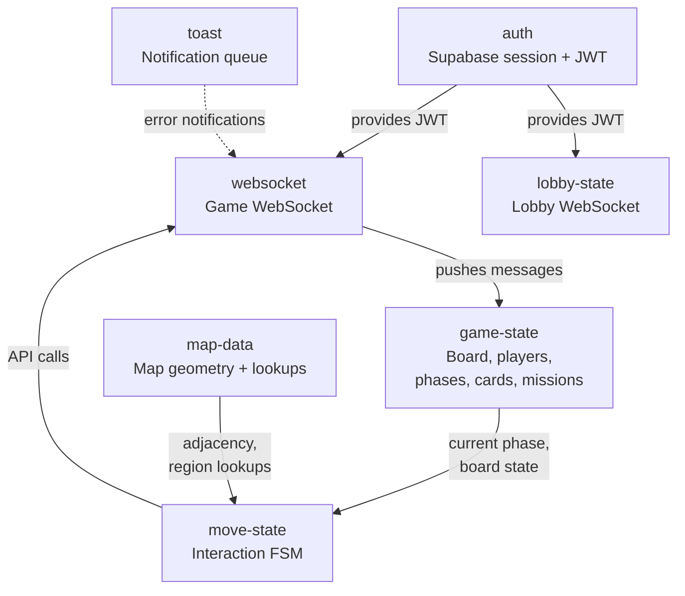
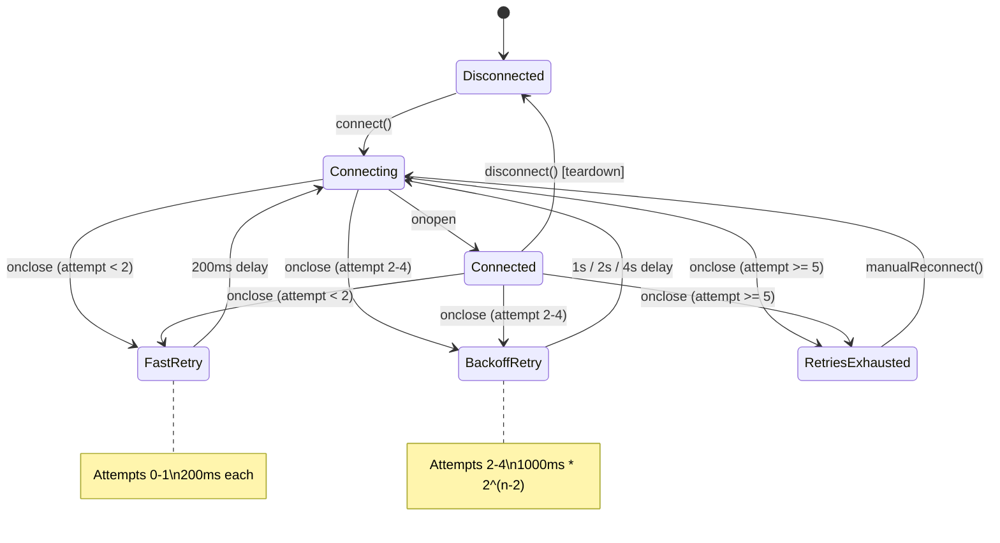
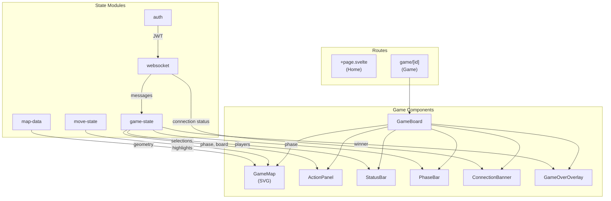
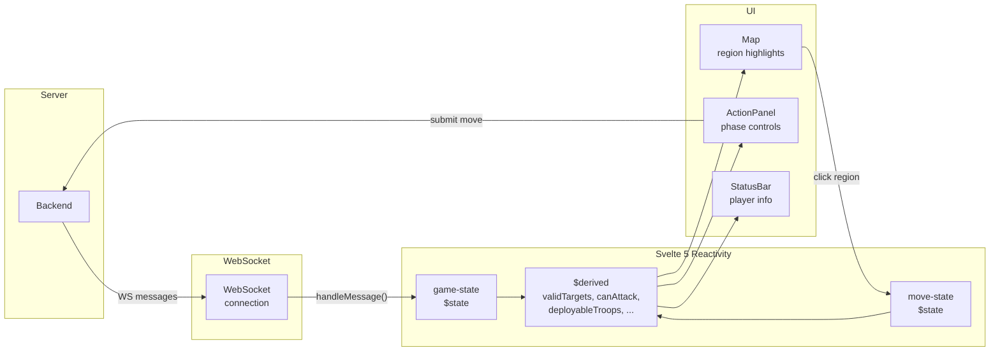

# Frontend Architecture

This document describes the architecture of the go-risk-it-frontend — a Svelte 5 SvelteKit application for playing Risk in the browser.

## State Architecture

The frontend uses **Svelte 5 runes** (`$state`, `$derived`, `$effect`) for all reactive state — no external store library. State is organized into independent modules that communicate through imports and function calls.



### Module Responsibilities

| Module          | File                                               | Responsibility                                                                        |
| --------------- | -------------------------------------------------- | ------------------------------------------------------------------------------------- |
| **auth**        | `auth.svelte.ts`                                   | Supabase session management, JWT access, sign-in/out, token refresh                   |
| **websocket**   | `websocket.svelte.ts` + `base-websocket.svelte.ts` | Game WebSocket connection with reconnection logic                                     |
| **lobby-state** | `lobby-state.svelte.ts`                            | Lobby WebSocket, participant tracking                                                 |
| **game-state**  | `game-state.svelte.ts`                             | All game data: board regions, players, current phase, cards, missions, move history   |
| **move-state**  | `move-state.svelte.ts`                             | User interaction state machine — tracks selected regions, valid targets, troop counts |
| **map-data**    | `map-data.svelte.ts`                               | Static map geometry loaded from `risk.json`, precomputed adjacency lookups            |
| **toast**       | `toast.svelte.ts`                                  | Notification queue (max 3 visible, auto-dismiss with configurable duration)           |

## WebSocket Reconnection Strategy

The `base-websocket` module implements a **dual-tier retry strategy** — fast retries for transient blips, then exponential backoff for sustained failures.



### Retry Timing

| Attempt | Tier                | Delay                     |
| ------- | ------------------- | ------------------------- |
| 0-1     | Fast retry          | 200ms                     |
| 2       | Exponential backoff | 1,000ms                   |
| 3       | Exponential backoff | 2,000ms                   |
| 4       | Exponential backoff | 4,000ms                   |
| 5+      | Exhausted           | Manual reconnect required |

### Reconnection Triggers

- **Automatic**: `onclose` event triggers retry if under the max retry count
- **Manual**: `manualReconnect()` resets all counters and reconnects (exposed to UI via `ConnectionBanner`)
- **Token refresh**: `reconnectWithNewToken()` gracefully closes the current connection (suppressing auto-retry), resets counters, and reconnects with a fresh JWT

## Component Architecture



### Data Flow



## Move Execution Flow

How a user action flows through the system, using an attack as an example:

1. **Select source** — User clicks an owned region with 2+ troops. `move-state` records it as the attacking region and computes valid targets using `map-data` adjacency.

2. **Select target** — User clicks an adjacent enemy region. `move-state` records it as the defending region. The `ActionPanel` shows troop selection controls.

3. **Submit** — User confirms the attack. The `ActionPanel` calls the API client:

   ```
   POST /api/v1/games/{id}/moves/attacks
   { "sourceRegionId": "...", "targetRegionId": "...", "troopsInSource": N }
   ```

4. **Backend processes** — The backend validates, rolls dice, updates troops, checks missions, and advances the phase (see [backend architecture](https://github.com/go-risk-it/go-risk-it/blob/main/docs/architecture.md#move-execution-flow)).

5. **WebSocket broadcast** — Backend emits updated `gameState`, `boardState`, and `playerState` to all connected clients.

6. **State update** — `game-state.handleMessage()` updates `$state` values. Svelte's reactivity engine recomputes all `$derived` values (valid targets, troop counts, phase info).

7. **UI re-render** — Components react to state changes: the map re-colors regions, the action panel updates for the new phase, the status bar refreshes player info.

## Map Rendering

The game map is rendered as an **SVG** with pan and zoom support:

- **Data source**: `src/assets/risk.json` contains region paths (SVG `d` attributes), continent groupings, and adjacency links
- **Layering**: Continents are rendered as SVG groups (`<g>`) in z-order, each containing its regions
- **Regions**: Each region is an SVG `<path>` with dynamic fill based on owner color, stroke for borders, and opacity changes for hover/selection states
- **Pan/Zoom**: Implemented via SVG `viewBox` manipulation with pointer events (drag to pan, wheel to zoom)
- **Highlights**: Valid attack/reinforce targets get a pulsing highlight effect. Selected regions get a distinct border style
- **Troop counts**: Displayed as text labels positioned at each region's centroid

## Audio System

Sound effects are synthesized at runtime using the **Web Audio API** — no audio files are loaded or bundled:

- **Tone generation**: The `audio.svelte.ts` module creates `OscillatorNode` instances with specific frequencies and waveforms
- **Events**: Different game events (attack, conquer, deploy, card trade, victory) trigger distinct tone patterns
- **Lightweight**: Zero audio assets in the bundle — all sounds are generated programmatically

## Move History Encoding

Move history payloads from the backend arrive with `move` and `result` fields encoded as **base64 JSON strings**. The `game-state` module decodes these before storing:

```
Backend sends:  { "move": "eyJyZWdpb25JZCI6InIxIn0=", "result": "eyJzdWNjZXNzIjp0cnVlfQ==" }
Frontend stores: { "move": { "regionId": "r1" }, "result": { "success": true } }
```

This encoding is a backend contract — the raw `move` and `result` values are opaque base64 strings on the wire. Malformed payloads are logged and skipped rather than crashing the message handler.

## Auth Flow

Authentication uses [Supabase](https://supabase.com/) (GoTrue) with JWT tokens:

1. **Sign-in/Sign-up** — User credentials are sent to GoTrue (via Kong API gateway). GoTrue returns a JWT access token and refresh token.
2. **Token storage** — The Supabase JS client stores tokens in memory. The `auth` state module exposes the current session.
3. **REST calls** — The API client (`lib/api/client.ts`) attaches the JWT as `Authorization: Bearer {token}` on every request.
4. **WebSocket auth** — JWTs are passed via the WebSocket subprotocol header: `Sec-WebSocket-Protocol: risk-it.websocket.auth.token, {JWT}`.
5. **Token refresh** — Supabase JS handles automatic token refresh. When a new token is issued, `reconnectWithNewToken()` re-establishes the WebSocket with the fresh JWT.
6. **Google OAuth** — Supported as an alternative sign-in method via Supabase's OAuth integration.
